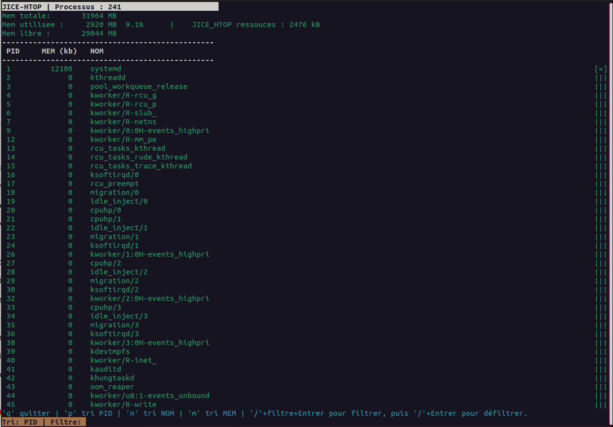

# JICE‑HTOP  
Mini réimplémentation pédagogique de *htop* en C / ncurses  
**Version 2.0 — Architecture multithread**  
Projet réalisé pour l’admission en 3e année Bachelor IT — La Plateforme

JICE‑HTOP est un moniteur système interactif en mode texte, écrit en C et basé sur ncurses.  
Il reproduit plusieurs fonctionnalités essentielles de *htop* en lisant directement les informations du système via `/proc`.

La version **2.0** introduit une **architecture multithread**, rendant l’interface plus fluide et réactive même lors de la collecte intensive des données système.



---

## Fonctionnalités principales

- Affichage en temps réel des processus  
- PID, nom, mémoire résidente (VmRSS)  
- Tri dynamique : **PID / NOM / MEM**  
- Filtrage interactif (`/`)  
- Scroll vertical fluide + **scrollbar proportionnelle**  
- Lecture directe de `/proc`  
- Lecture de la RAM via `/proc/meminfo`  
- Interface ncurses colorée et ergonomique  
- **Multithreading : UI et collecte système séparées**  
- **Double-buffering (Snap)** pour réduire le temps de verrouillage du mutex

---

## Architecture du projet

```
jice_htop/
│
├── src/
│   ├── main.c          # boucle UI, ncurses, interactions
│   ├── sysproc.c       # lecture /proc, RAM, tri
│   ├── threadshare.c   # thread de collecte, double-buffering
│   ├── uiwin.c         # affichage, bandeaux, scrollbar
│
├── include/
│   ├── sysproc.h
│   ├── threadshare.h   # structure partagée t_shared + mutex
│   ├── uiwin.h
│
└── Makefile
```

---

## Architecture multithread (V2.0)

### Thread principal — Interface utilisateur
- ncurses  
- affichage  
- clavier  
- scroll  
- filtrage  
- tri  
- **ne lit plus /proc**  

### Thread secondaire — Collecte système
- lecture de `/proc/[PID]/*`  
- lecture de `/proc/meminfo`  
- mise à jour des données partagées  
- boucle indépendante (200 ms)  

### Synchronisation
- mutex protégeant la structure partagée  
- double-buffering pour limiter la durée des sections critiques  
- modèle robuste et scalable  
- architecture proche des outils Linux professionnels  

---

## Compilation

Installer ncurses :  
sudo apt install libncurses-dev
Compiler :  make
Nettoyer :  make clean
Exécuter :  ./jice_htop

---

## Commandes

- `q` : quitter  
- `p` : tri par PID  
- `n` : tri par NOM  
- `m` : tri par MEM  
- `↑ / ↓` : scroll  
- `/` : filtrage interactif  

---

## Détails techniques

### Lecture des processus
- `/proc/[PID]/comm` → nom  
- `/proc/[PID]/status` → VmRSS  
- détection des PID via `readdir()`  

### Lecture de la RAM
- `/proc/meminfo`  
- RAM utilisée = `MemTotal – MemAvailable`  

### Scrollbar proportionnelle
```c
bar_pos = (scroll_offset * (bar_height - 1)) / max_scroll;
```

---

## Dépendances
- Linux  
- /proc  
- ncurses  
- GCC  

---

## Auteur
Projet réalisé par **Jean‑Christophe Gerace   @Jicé**  
Dans le cadre du **test d’entrée B3 – La Plateforme (2026)**.

---

## Roadmap (V3.0)
- Export JSON des processus  
- Affichage CPU par cœur  
- Kill de processus  
- Tests unitaires  

