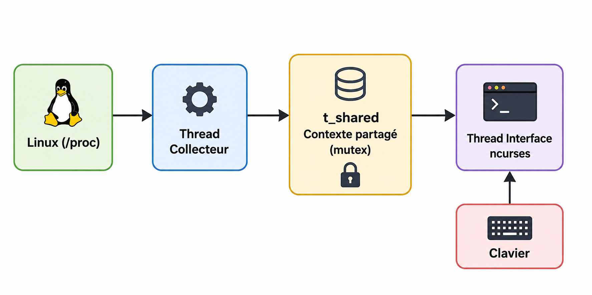

# JICE_HTOP
**Moniteur système Linux interactif développé en langage C avec ncurses.**


**Contexte du projet**

Ce projet a été initié dans le cadre de mon admission directe en *3ᵉ année Bachelor IT – Développeur Logiciel & DevOps* à **La Plateforme** (Marseille).
Il continue aujourd'hui d'évoluer comme projet personnel me permettant d'accompagner ma montée en compétence en développement système sous Linux et en qualité logicielle.

> **Objectif :** mettre en œuvre une architecture modulaire, un modèle concurrent basé sur POSIX Threads et une collecte des informations système via `/proc`.

---

## Aperçu


---

## Fonctionnalités

### Supervision système

- mémoire RAM (totale, utilisée, disponible, pourcentage)
- empreinte mémoire du processus jice_htop lui-même
- nombre de processus actifs


### Gestion des processus

- lecture du système `/proc`
- liste des processus actifs
- tri par PID, nom ou mémoire
- filtrage interactif
- rafraîchissement temps réel

### Interface utilisateur

- interface texte avec **ncurses**
- navigation clavier
- scrollbar proportionnelle

---

## Compétences mises en œuvre

| Domaine | Technologies |
|----------|--------------|
| Langage | C |
| Système | Linux, `/proc` |
| Interface | ncurses |
| Concurrence | POSIX Threads, mutex |
| Architecture | Modulaire |
| Mémoire | Allocation dynamique |
| Build | GCC, Make |
| Versioning | Git, GitHub |
---

## Architecture

Le projet repose sur une séparation  des responsabilités :
- acquisition des données système ;
- synchronisation des données partagées ;
- affichage de l'interface utilisateur.




Le cœur de l'application repose sur un **contexte partagé (`t_shared`)** synchronisé par mutex entre un thread de collecte et le thread principal chargé de l'affichage.

---

### Organisation du dépôt

```text
jice_htop/
├── src/
├── include/
├── docs/
├── debug/
├── test/
├── assets/
├── Makefile
├── CHANGELOG.md
└── README.md
```


## Choix de conception

### Accès direct à `/proc`

Le projet lit directement les pseudo-fichiers du système /proc plutôt que de s'appuyer sur une bibliothèque spécialisée.
Ce choix facilite la compréhension des mécanismes internes de Linux et conserve une maîtrise complète du traitement des données.


## Documentation

Une documentation technique complémentaire et détaillée est disponible dans le dossier docs/.
---

## Compilation

Installation de la dépendance :

```bash
sudo apt install libncurses-dev
```

Compilation :

```bash
make
```

Exécution :

```bash
./jice_htop
```

---

## Commandes

| Touche |      Action           |
|--------|-----------------------|
| q, Q   |      Quitter          |
| p, P   |     Tri par PID       |
| n, N   |     Tri par nom       |
| m, M   |     Tri par mémoire   |
| ↑ ↓   |     Défilement        |
|  /     | Filtrer les processus |

---

## Roadmap

### Fonctionnalités

- [ ] Arrêt ("kill") d'un processus
- [ ] Nouvelles métriques système
- [ ] Amélioration du moteur de rendu

**Affichage**
- utilisation CPU
- mémoire Swap
- uptime

### Qualité logicielle

- [ ] Intégration de `cppcheck`
- [ ] Intégration de `clang-tidy`
- [ ] Pipeline GitHub Actions
- [ ] Couverture de tests
- [ ] Choix d'une licence Open Source
---

## Qualité logicielle

La qualité du code est vérifiée régulièrement à l'aide des outils suivants :
À ce jour, les analyses ne mettent en évidence aucune fuite mémoire imputable au code applicatif (definitely lost: 0).

- compilation sans avertissement (`-Wall -Wextra -Werror`)
- analyse mémoire avec **Valgrind (Memcheck)**
- vérification de l'exécution avec **AddressSanitizer (ASan)**
- détection des comportements indéfinis avec **UndefinedBehaviorSanitizer (UBSan)**


## Auteur

**Jean-Christophe Gerace**   *@jicé*

Projet personnel développé dans le cadre de ma spécialisation en Développement Logiciel & DevOps.


